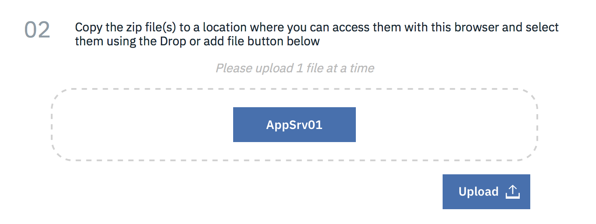
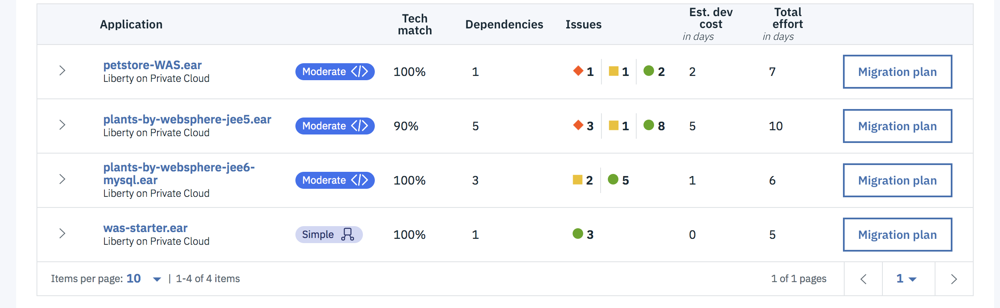
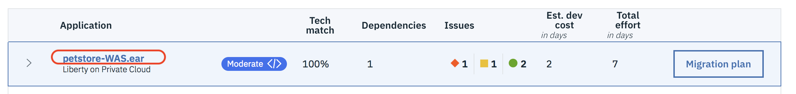
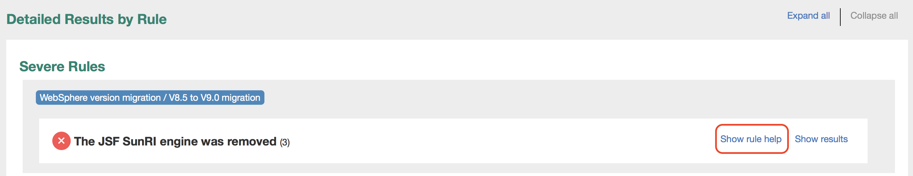
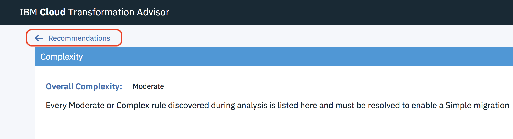
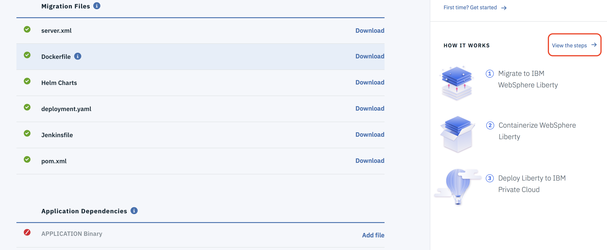
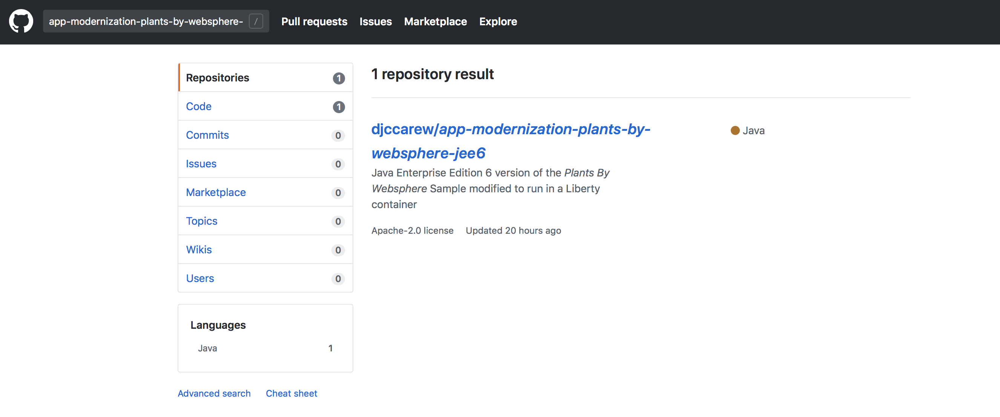
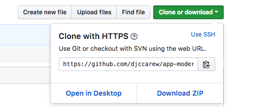
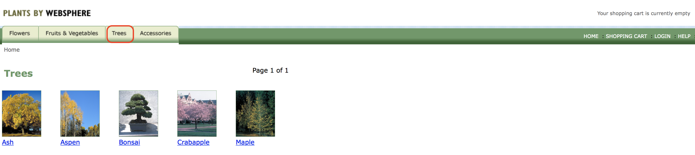

# IBM Client Developer Advocacy App Modernization Series

## Lab - Migrating Legacy JEE apps to IBM Cloud Private

### Part 1 - Working with IBM Cloud Transformation Advisor

## Overview

The IBM Cloud Transformation is a developer tool available on IBM® Cloud Private. It can quickly evaluate your on-premises applications for rapid deployment on WebSphere Application Server and Liberty on public or private cloud environments.

In this lab you'll run Transformation Advisor against the data collected from an instance of WebSphere Application Server V8.5.5 and examine the recommendations provided for a different Java EE applications. You'll then redeploy one of those apps (the WebSphere sample app Plants By WebSphere) on a Liberty container running in IBM Cloud Private using the migration bundle  generated for this app by Transformation Adviser.


### Step 1: Launch Transformation Advisor and import data collected from  WebSphere Application Server

Transformation Advisor organizes your legacy server scans into workspaces and collections. Specific server scans are typically put into to separate collections. You'll use a completed server scan as a starting point for the lab

1. Download the server scan by right clicking on [this link](ta/AppSrv01.zip) and selecting **Save Link As** from the context menu to save the file locally.

2. Login in to Transformation Advisor using the URL and credentials provided to you by your instructor

3. Click on **Add a new workspace**

4. Enter a unique name for your workspace e.g. `usernn_ta_workspace` where `usernn` is your ICP user ID (e.g. `user11`)

5. Click **Next** and enter a name for the collection e.g. `lab_collection`

6. Click **Let's go**

7. At this point you have the option of downloading a data collection script for your legacy server to collect the data about all the installed applications or upload the results of a data collection script. Click **Upload data** then click **Drop or Add File** and select the file **AppSrv01.zip** you downloaded previously.



8. Click **Upload** to upload the file

9. You should be presented with a summary of recommendations for 4 applications running on the WebSphere Application Server instance where the data collection script was run.



### Step 2: Explore the report generated by Transformation advisor

1. Lets's look at the apps designated with red to indicate that changes to the app are required before running the app on WebSphere Liberty. Click on the link for the app **petstore-WAS.ear**. This is a JavaEE 5 app written by the Java BluePrints program that validates several Java EE 5 features.



2. Scroll down to the bottom of the page and click on **Analysis Report**. Click **OK** when prompted.

3. The analysis will open up in a new browser tab. Scroll down to the section with title **Detailed Results by Rule** and click on **Show rule help** next to the rule named **The JSF SunRI engine was removed** to see more details about what needs to be fixed to migrate the Java Pet Store app to WebSphere Liberty running on ICP. Take a look at some of the  other information in the report to get a feel for what type of information to expect when running Transformation Advisor against your own legacy Java EE apps.



4. Go back to the **IBM Transformation** browser tab and click on **<- Recommendations** to go back to the list of apps.



5. This time take a look at one of the "show stoppers" for the app **plants-by-websphere-jee5.ear** by selecting the app and then clicking on the Analysis Report link. This version of the  WebSphere sample Plants by WebSphere was shipped with WebSphere Application Server V7.0. Two  of the  three severe issues have to do with no support for the JAX-RPC API in Liberty. Note: with the explosion of REST based APIs, technologies like JAX-RPC and SOAP/WSDL have become more or less obsolete.

6. Go back to the **IBM Transformation** browser tab and click on **<- Recommendations** to go back to the list of apps.

7. Now you'll look at the migration plan for the app **plants-by-websphere-jee6-mysql.ear**. This is the Plants By WebSphere  app that comes with WebSphere Application Server 8.5.5 and  has been tweaked to work with the MySQL database instead of the  embedded Apache Derby database that the original uses. Note that this version uses JAX-RS (the Java API for RESTful Web Services) instead of JAX-RPC and JAX-RS is fully supported on WebSphere Liberty. Click on **Migration plan** as shown below


8. On the left you should see a list of files generated to aid the migration of the app to Liberty running in ICP . On the right click the link **View the steps ->**



9. Look through the migration steps. You'll be (more or less) following these steps  in this and subsequent labs (except for the first step where it is suggested to validate the app to be migrated can run on a local copy of WebSphere Liberty)


### Step 3: Clone the Github repo that contains the code, build a WebSphere Liberty image of the app and then push it to the ICP private repository

**Note:** This lab is designed for a multiuser IBM Cloud Private installation where each student is using a client shell with a unique username available via the ENV var $USER.


1. Login in [your Github account](https://github.com)

2. In the search bar at the top left type in `app-modernization-plants-by-websphere-jee6`



3. Select the repository `djccarew\app-modernization-plants-by-websphere-jee6` and then click on the **Fork** icon

4. Click the **Clone or download** button from your copy of the forked repo and copy the HTTPS URL to your clipboard



5. Login to the VM designated as the client env to ICP using the credentials  provided  to you

6. From a client terminal window clone the Git repo  with  the following commands  appending the HTTPS URL from your clipboard
```
     git clone [HTTPS URL for NEW REPO]
     cd app-modernization-plants-by-websphere-jee6
```

7. Build the application .ear file using Maven by typing in (or copying and pasting in) the following command
```
   mvn package

```
8. Build a docker image  by typing in (or copying and pasting in) the following (uncommented) commands
```
   # Note substitute your ICP namespace (e.g devnamespace09) for [YOUR_DEVNAMESPACE]
   docker build -t mycluster.icp:8500/[YOUR_DEVNAMESPACE]/pbw-mariadb-web:1.0.0 .

```
9. Log in to the ICP Cluster with the following command (Note substitute your ICP Master IP for **[ICP Master IP]**)
```
    cloudctl login -a [ICP Master IP]:8443 --skip-ssl-validation
```

10. Push the image to the ICP private repository by typing in (or copying and pasting in) the following (uncommented) commands
```
   # Login to the ICP private repository
   docker login mycluster.icp:8500

   # Push the image. Note substitute your ICP namespace (e.g devnamespace09) for [YOUR_DEVNAMESPACE]
   docker push mycluster.icp:8500/[YOUR_DEVNAMESPACE]/pbw-mariadb-web:1.0.0

```

### Step 4: Deploy the app to ICP and test it

We've provided you with some scripts to generate the Kubernetes metadata required to deploy the app and connect it to the  original MySQL database it was using when running in WebSphere Application Server

1. Generate the  Kubernetes secrets for the MySQL database credentials. You instructor will provide you with the correct values for username, password, host and port. Run the following command from  your terminal:
```
   scripts/create-secrets.sh

```

2. Validate the database connection info you provided by running the following command with the URL of the verification service provided by the instructor. Note: if you get an error compare the values you provided with those provided by the instructor and repeat the previous step.
```
   scripts/test-db-connection.sh <URL to validation program>

```

3. Generate the Kubernetes deployment and service for the app by running the following command and entering your ICP namespace when prompted.
```
  scripts/create-deployment.sh

```

4. Deploy to ICP by typing in (or copying and pasting in) the following (uncommented) commands:
```
   # Create the secrets
   kubectl create -f k8s/pbw-liberty-mariadb-credentials.yaml

   # Deploy the app
   kubectl create -f k8s/pbw-liberty-mariadb-deployment.yaml

```

5. Get the port exposed for the app you just deployed by running this command:
```
   echo `kubectl get svc pbw-liberty -o jsonpath='{.spec.ports[0].nodePort}'`

```

6. Test the app by entering the following URL in your  browser. The **nodePort** is the port returned from the previous command and the **[ICP Proxy URL]** should be provided to you by your instructor:
```
   [ICP_PROXY_URL]:[nodePort]/pbw/index.html

```

7. The app should appear in your browser and you should be able to see items in the Catalog by browsing in different categories



### Step 5: Clean up

1. Run the following command to uninstall the app and remove all related resources

```
   kubectl delete svc, deploy, secret -l app=pbw-liberty-mariadb

```


## Summary

Take a bow. You've gone through the process of migrating an app running on WebSphere Application Server to a containerized version running on WebSphere Liberty in ICP.
